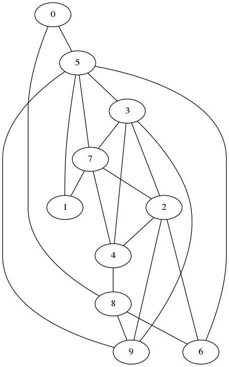
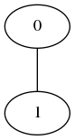

# Erlang B Model

[](https://travis-ci.org/NigoroJr/erlang-b-model)

## Description

This is a program for simulating an arbitrary network of M/M/c/c systems. The
simulation result is shown as the blocking probability of the whole network.

## Simulation
Two random nodes initiate connection at a rate that is distributed
exponentially with parameter lambda (specified by command line option
`-l` or `--lambda`) with each connection having duration that is also
distributed exponentially (with parameter `-d` or `--duration`). The two nodes
are selected randomly with a uniform distribution. After a certain number of
completed connections (`-t` or `--total`), the blocking probability of the
network is calculated. The initial 10% of the connections are ignored in order
to observe the steady state behavior.

Wavelength conversion capability can be enabled (with `-c` or `--converter`)
to allow using an empty wavelength when a connection is initiated. It is
assumed that there are enough converters (i.e. however many wavelengths there
are) in each node to accommodate converting any wavelength request. This
simplifies the search algorithm.

## Building
Boost Graph Library is used for this project. Boost unit testing framework is
also used for unit testing.

```sh
cd ./build
cmake ..
make -j5
```

For unit tests, run `ctest` in the `build` directory.

## Usage
The following figure shows a sample network with 10 nodes and 20 edges.



The input file for this network is written as:

```
20
0 5
1 5
2 4
2 6
3 2
3 7
4 3
4 8
5 3
5 7
5 9
6 5
7 1
7 2
7 4
8 0
8 6
8 9
9 2
9 3
```

The first number is the number of edges. The `misc/make_connections.rb` script
is a utility script to generate random vertices and edges.

Another input file included is shown in the following figure:



In this network, connections are always between the same two nodes. Thus, the
Erlang B formula can be used to verify the results of the simulation.

The program is invoked with:

```sh
PROGRAM_NAME <input file> <num wavelengths>
```

Running the program with option `-h` or `--help` shows the available command
line options. The number of wavelengths is the number of servers available for
one node. The more wavelengths there are, the lower the blocking probability
gets.

## Thanks
[cxxopts](https://github.com/jarro2783/cxxopts) for command line option
parsing.

## License
MIT License

## Author
Naoki Mizuno
